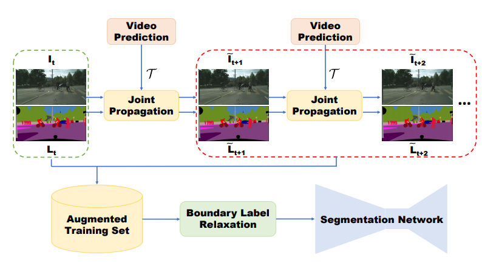

## Improving Semantic Segmentation via Video Propagation and Label Relaxation

#### Introduction

synthesizing new training samples: use a  video prediction-based methodology

video prediction: prone to producing unnatural distortions along object boundaries

#### Contribution

label propagation:

- patch matching: sensitive to patch size and threshold
- optical flow: rely on accurate optical flow

This paper:

- motion vectors from video prediction (self-supervised training)

 -	joint image-label propagation

Boundary handling:

- edge cues as constraints
  - error propagation from edge estimation
  - overfitting:  fitting extremely hard boundary cases 
- structure modeling: affinity field [21], random walk [5], relaxation labelling[37], boundary neural fields [4]
  - not directly deals with boundary pixels

This Paper: predict multiple classes at a boundary pixel

#### Method

###### Video Prediction

SDC-Net: Video Prediction using Spatially-Displaced Convolution

###### Boundary Label Relaxation

difficult to classify the center pixel of a receptive field when potentially half or more of the input context could be from a different class

For boundary pixels:

- x maximizing the likelihood of the target label
- maximize the likelihood of $P(A \cup B) = P(A) + P(B)$,  A, B is neighbor classes

- loss is $\mathcal{L}_{boundary} = -log\sum_{C\in\mathcal{N}}{P(C)}$

