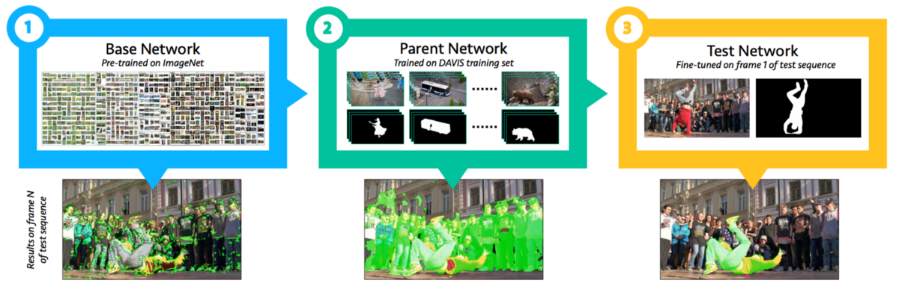
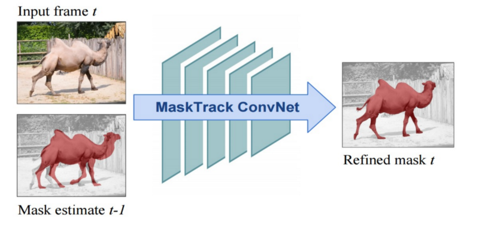

## Video Segmentation Overview
#### Basic

roadmap:

- interleave box tracking with box-driven segmentation
- propagate the first frame segmentation via graph labeling

Lucid Data Dreaming augmentations, temporal component

### Approaches

#### Semi-supervised

###### Matching-based

- OSVOS
- OnAVOS (Online adaptation of convolutional neural networks for video object segmentation, BMVC 2017)
- updating the network online with additional high confident predictions
- OSVOS-S(Video object segmentation without temporal information,  PAMI 2018)
     - semantic information from an instance segmentation network
     - using the instance segments of the different objects in the scene as prior knowledge and blend them with the segmentation output

- **Lucid**

   - FAVOS, PML, videomatch

     

###### Propagation-based

- MaskTrack
- LucidTracker (Lucid Data Dreaming for Video Object Segmentation, IJCV)
- CRN (Motion guided cascaded refinement network for video object segmentation, CVPR2018)
  - applying active contour on optical flow to find motion cues
- **CINM**: (Video object segmentation via inference in a CNN-based higher-order spatio-temporal MRF, CVPR2018)
  - long-term temporal dependency
- MoNet:  (MoNet: Deep motion exploitation for video object segmentation, CVPR2018)
  - exploits optical flow motion cues by feature alignment and a distance transform layer
  - combined temporal information from nearby frame to track the target
- LSE: (Video object segmentation by learning location-sensitive embeddings, ECCV2018)
  - Location-sensitive embeddings used to refine an initial foreground prediction
  - combined temporal information from nearby frame to track the target

- OSMN, RGMP, FEELVOS, MHP-VOS, RVOS
  - meta-learning , Conditional Batch Normalization (CBN) to gather spatiotemporal features
  - applied instance detection

- STCNN (Spatiotemporal CNN for Video Object Segmentation, CVPR2019)
  - the temporal coherence branch pretrained in an adversarial fashion from unlabeled video data

###### Detection-based 

- MHP-VOS: (MHP-VOS: Multiple Hypotheses Propagation for Video Object Segmentation, CVPR2019)
  - cases that objects are occluded or missing

###### Fast (without fine tune)

- FAVOS (Fast and accurate online video object segmentation via tracking parts, CVPR2018)
- PML (Blazingly fast video object segmentation with pixel-wise metric learning, CVPR2018)
- Videomatch (Videomatch: Matching based video object segmentation, CVPR2018)

- OSMN (Efficient video object segmentation via network modulation, CVPR2018)
  - meta-learning 
- RGMP (Fast video object segmentation by reference-guided mask propagation, CVPR2018)
- FEELVOS (Fast End-to-End Embedding Learning for Video Object Segmentation, CVPR2019)

#### Unsupervised

- RVOS (RVOS: End-to-End Recurrent Network for Video Object Segmentation: CVPR2019)
- IET, (Instance Embedding Transfer to Unsupervised Video Object Segmentation: CVPR2018)
  - adapt the instance networks trained on static images
  - incorporate the embeddings with objectness and optical flow features
- LMP (Learning motion patterns in videos, CVPR2017)
  - takes optical flow as an input to separate moving and non-moving regions
  - combines the results with objectness cues from SharpMask [35] to generate the moving object segmentation 
- LVO (Learning video object segmentation with visual memory, ICCV2017)
  - two-stream network, using RGB appearance features and optical flow motion features
- **FSEG** (Fusionseg: Learning to combine motion and appearance for fully automatic segmention of generic objects in videos, CVPR2017)
  - two-stream network trained with mined supplemental data

##### Early works

Bilateral space video segmentation, 2016

Video segmentation via object flow, 2016

Efficient video segmentation using parametric graph partitioning, 2015

Streaming hierarchical video segmentation, 2012

### Details

#### OSVOS (One Shot Video Object Segmentation)

1. Take a net (say VGG-16) pre-trained for classification for example, on imagenet.
2. Convert it to a fully convolutional network, à la [FCN](https://arxiv.org/abs/1605.06211), thus preserving spatial information:
   \- Remove the FC layers in the end.
   \- Insert a new loss: pixel-wise sigmoid balanced cross entropy (previously used by [HED](https://arxiv.org/abs/1504.06375)). Now each pixel is separately classified into foreground or background.
3. Train the new fully convolutional network on the DAVIS-2016 training set.
4. **One-shot training:** At inference time, given a new input video for segmentation and a ground-truth annotation for the first frame (remember, this is a semi-supervised problem), create a new model, initialized with the weights trained in [3] and fine-tuned on the first frame.

#### MaskTrack (Learning Video Object Segmentation from Static Images)

###### offline training

conditional mask prediction

hypothesis: mask estimation are smooth among two near frames 

train: image dataset, use augmentation (deformation and affine transformation on mask) to simulate last frame prediction

test: RGB+last frame mask estimation -> current frame mask estimation

###### online training

fine tune on test video,  generate multiple training samples by augmentation (deformation and affine transformation on mask)

#### CRN

 Motion-guided cascaded refinement network for video object segmentation 